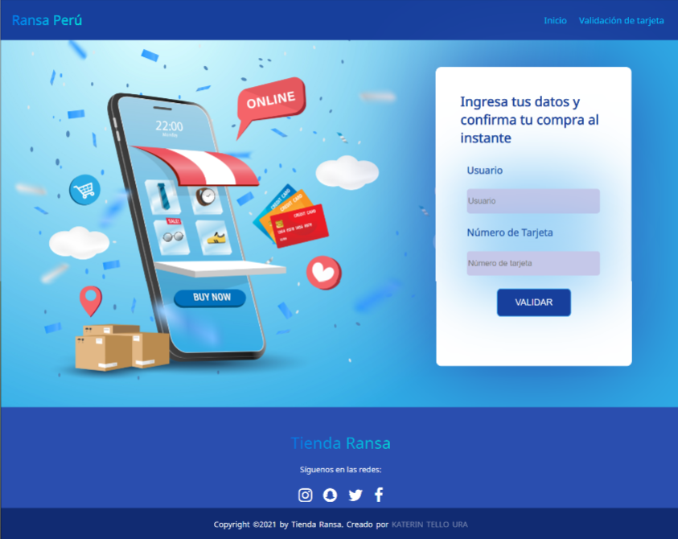
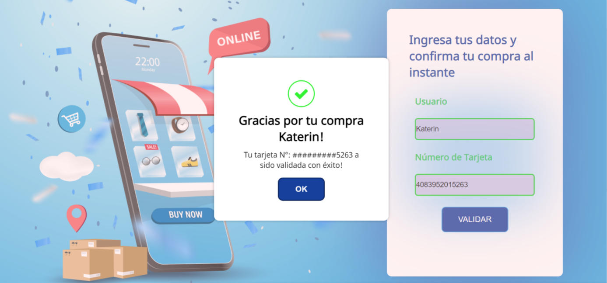
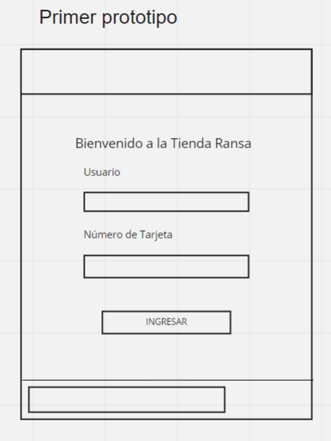

## Título del proyecto: "Tienda Ransa Perú"
   
El proyecto trata de una tienda E-commerce de productos tecnológicos, cómoda, sencilla e intuitiva que le permitirá al usuario poder completar con éxitos su proceso de compra validando su tarjeta de forma rápida y segura .

## Imagen del Proyecto Final:
  Pantalla de inicio

  Pantalla de Tarjeta Válida

## Investigación UX:
   Los principales usuarios del producto son aquellos clientes interesados en comprar productos tecnológicos de forma online en la tienda teniendo como objetivo completar su proceso de compra en la Tienda Ransa mediante la validación de su tarjeta y su dato de usuario.

   El producto al contar con un proceso de validez de tarjeta y ocultación de numeros le permitirá al usuario validar su tarjeta permitiendole completar su proceso de compra y evitando así tener contratiempos al momento de la entrega de su producto ya que su transacción de pago se valida y se realiza con éxito su compra y envío.

Primer Prototipo en Figma:

https://www.figma.com/file/9sk22LJtpPDySVJNP1nrdw/Prototipo-1

Segundo Prototipo en Figma:

https://www.figma.com/file/GB6twDeEbjKzL0ThucuvAq/Prototipo-2

## Feedback :

Desde el inicio del proyecto recibí feedback tanto de mis compañeras como de mis coach lo cuál me permitió mejorar en el proceso.Por un lado, me sugirieron mejorar la presentación de los colores en mi proyecto, agregarle un popup para la validación, mejorar en el uso del css y añadirle un footer más amigable.

## Imagen del Prototipo Final en Figma:

https://www.figma.com/file/pldxA6kEdaB9lQ1dgdtrMc/Untitled?node-id=0%3A1G)

## Link de GitHub Page donde podrás ver mi proyecto:

https://katerint.github.io/LIM016-card-validation/src/

